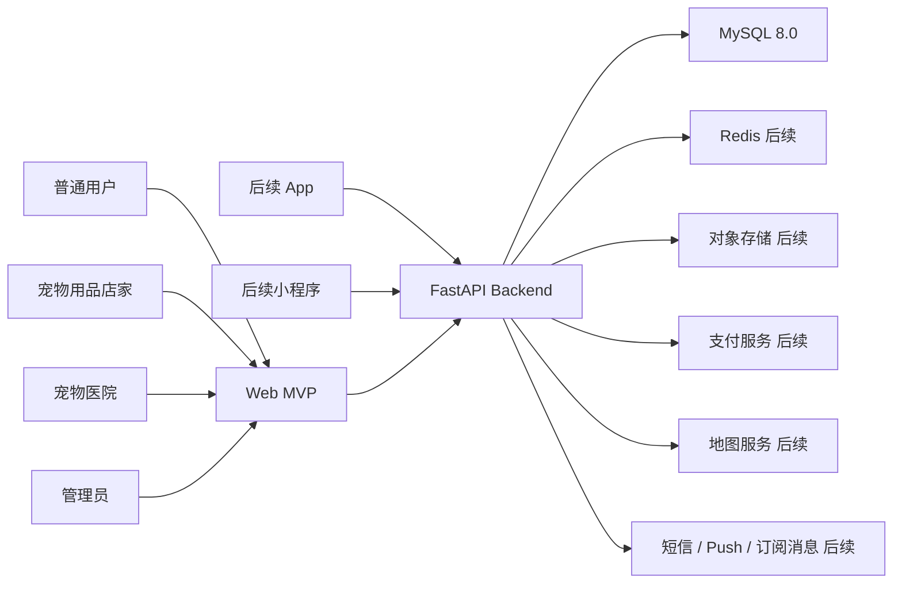
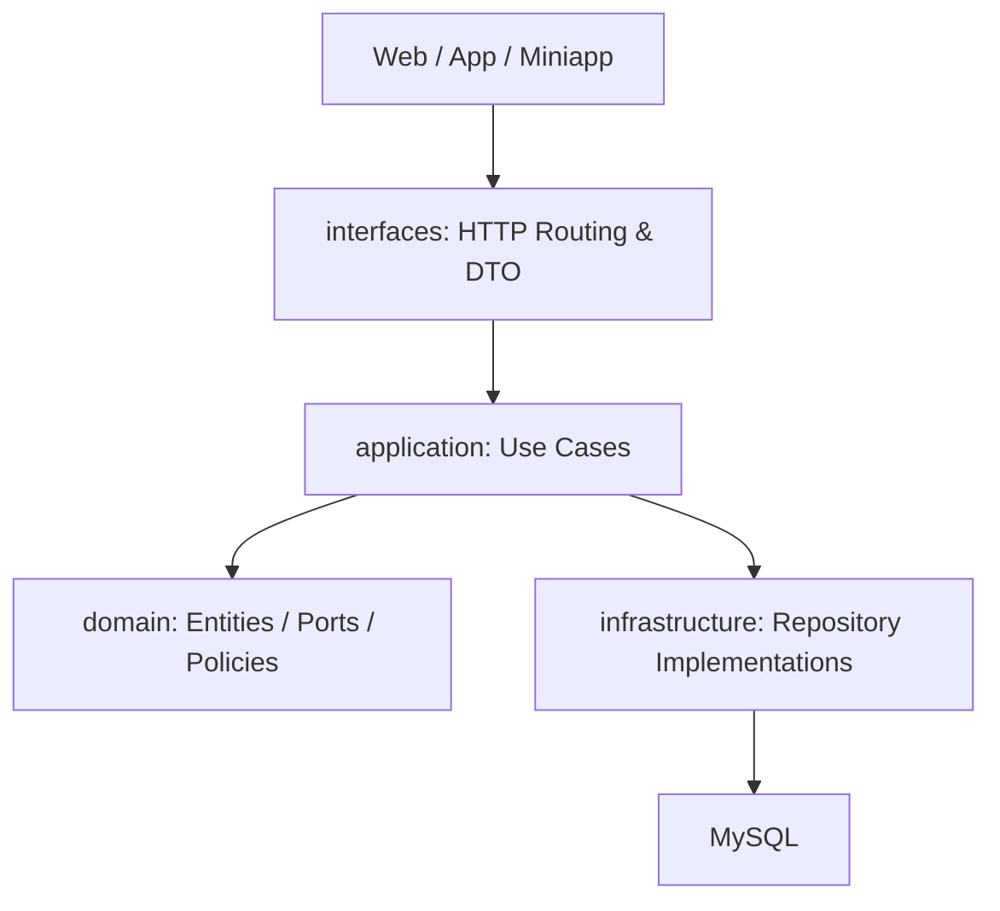
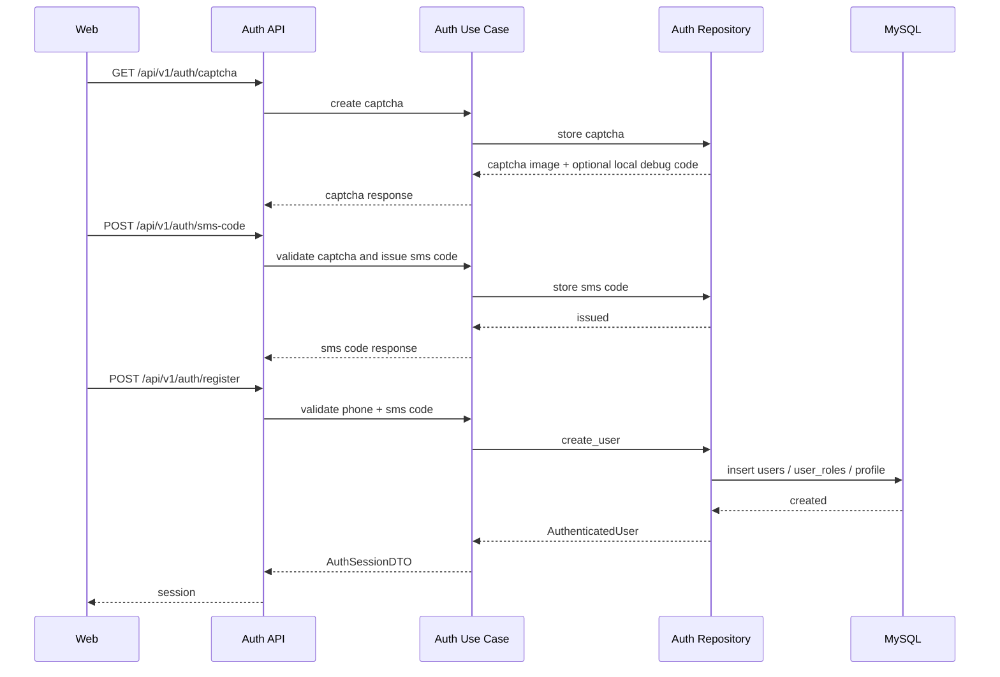
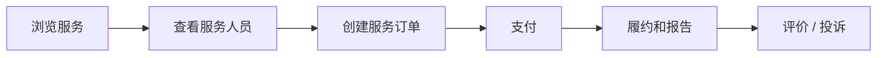
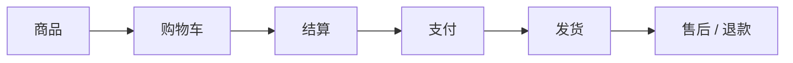
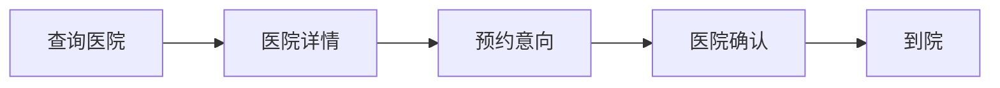
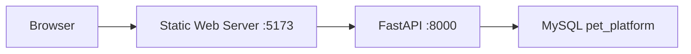
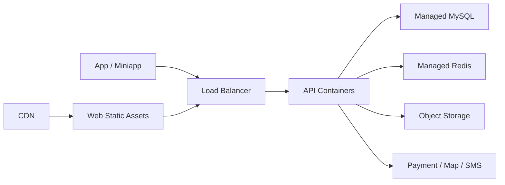

# Pet Platform Architecture

## 1. 架构目标

Pet Platform 面向普通用户、宠物用品店家、宠物医院和平台管理员。当前阶段采用“模块化单体后端 + MySQL + 静态 Web MVP”的方式起步，优先保证本地可运行、业务边界清晰，并为后续 App、小程序和独立管理后台预留扩展空间。

核心目标：

- Web、后续 App 和小程序共享同一套后端 API。
- 账号、角色、权限、宠物档案、订单、商品和医院数据统一建模。
- 上门服务、商城、医院三条业务链路可以独立演进。
- 管理能力和用户端能力隔离，避免权限混乱。
- 后端保持清洁架构，便于后续按领域拆分服务。

## 2. 系统上下文

## 3. 后端分层

分层职责：

- `interfaces`：路由、请求响应模型、依赖注入、HTTP 异常映射。
- `application`：业务用例编排，例如登录、注册、工作台查询。
- `domain`：实体、枚举、repository port 和领域规则。
- `infrastructure`：MySQL repository、外部系统适配器。
- `core`：配置、数据库连接、安全工具。

依赖方向只允许从外层指向内层。领域层不依赖 FastAPI、SQLAlchemy 或数据库实现。

## 4. 当前模块

### identity/auth

- 手机号、网页图形验证码和短信验证码登录注册。
- 四类角色注册。
- 本地验证码调试输出和短信发送适配器。
- 管理员注册保护。
- 用户、角色和 profile 初始化。

### dashboard

- 根据角色返回工作台指标和任务。
- 支持 `CUSTOMER`、`MERCHANT`、`HOSPITAL`、`ADMIN`。

### catalog

- 商品目录查询。
- 医院目录查询。

### user

- 用户列表和基础信息。
- 后续扩展为后台用户管理。

## 5. 核心业务链路

### 5.1 登录注册

关键规则：

- 手机号唯一。
- 注册角色必须在系统枚举内。
- 店家和医院账号默认进入 `PENDING` 审核状态。
- 管理员注册默认关闭，只能通过配置开启。

### 5.2 上门服务

后续重点：

- 服务人员时段锁定。
- 支付超时自动关闭。
- 签到位置和服务报告防伪。
- 服务异常上报和仲裁。

### 5.3 商城

后续重点：

- 后端计算订单金额。
- 事务内扣减库存。
- 支付失败释放库存。
- 售后和退款写审计日志。

### 5.4 医院

后续重点：

- 医院资质审核。
- 医生排班。
- 到院状态追踪。
- 疫苗、驱虫、体检等健康提醒。

## 6. 数据边界

- 隐私数据：手机号、地址、门锁、宠物健康记录。
- 交易数据：服务订单、商城订单、支付、退款、优惠。
- 供给数据：服务人员、店家、医院、医生。
- 内容数据：文章、评论、评价、服务报告。
- 运营数据：公告、活动、推荐位、审计日志。

策略：

- 日志不输出完整敏感信息。
- 管理后台默认脱敏展示敏感字段。
- 高风险操作写入 `audit_logs`。
- 支付回调必须验签。

## 7. 部署拓扑

### 本地 MVP

### 生产建议

## 8. 演进路线

第一阶段：

- 模块化单体。
- 单 MySQL。
- 静态 Web + FastAPI。
- 四角色登录注册和工作台。

第二阶段：

- React + TypeScript Web。
- Alembic 迁移。
- JWT 和 RBAC。
- Redis、异步任务、结构化日志。

第三阶段：

- App 和小程序。
- 真实支付、地图、短信。
- 独立管理后台。
- 按 bounded context 拆分服务。
