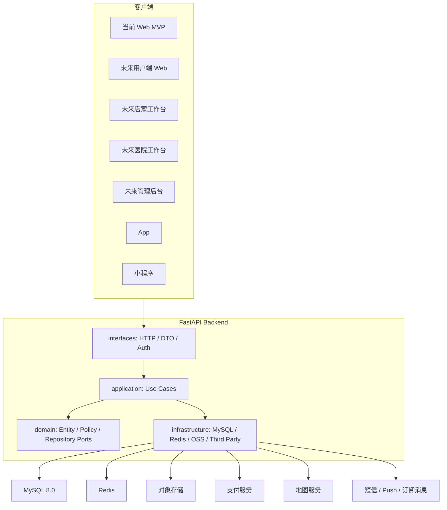
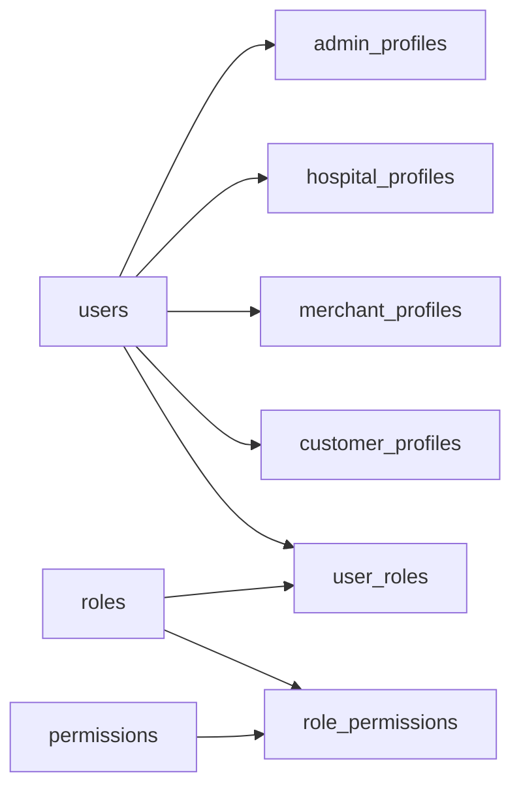

# Pet Platform Enterprise Architecture

## 1. 使用者分层

系统使用者分为四类，统一进入账号体系，再通过角色、权限和业务身份决定可访问功能。

| 使用者 | 角色编码 | 核心能力 |
| --- | --- | --- |
| 普通用户 | `CUSTOMER` | 宠物档案、上门服务预约、商城购买、医院查询、订单评价 |
| 宠物用品店家 | `MERCHANT` | 店铺资料、商品管理、库存管理、商城订单、售后处理 |
| 宠物医院 | `HOSPITAL` | 医院资料、医生管理、预约意向、科室服务、医疗内容 |
| 管理员 | `ADMIN` | 用户管理、商户审核、医院审核、订单监管、运营配置、审计日志 |

设计原则：

- 账号和角色统一建模，不为每类用户建立独立登录系统。
- 业务身份与账号解耦，一个账号未来可以拥有多个角色。
- 权限不散落在路由函数中，通过 RBAC 权限点统一校验。
- 高风险操作必须记录审计日志。

## 2. 总体架构



依赖规则：

- `domain` 不依赖框架、数据库或 Web 协议。
- `application` 只编排用例，依赖领域接口。
- `infrastructure` 实现领域层定义的 repository port。
- `interfaces` 负责 HTTP、鉴权、序列化和异常映射。
- 跨模块通信优先通过应用服务和领域事件，不直接访问其他模块表。

## 3. 后端目录规划

```text
backend/
  app/
    main.py
    core/
      config.py
      database.py
      security.py
      errors.py
    domain/
      shared/
      identity/
      pets/
      merchants/
      hospitals/
      orders/
      mall/
      services/
    application/
      auth/
      dashboard/
      catalog/
      pets/
      merchants/
      hospitals/
    infrastructure/
      persistence/
        mysql/
      security/
      messaging/
      storage/
    interfaces/
      http/
        routers/
        dependencies.py
        error_handlers.py
    tests/
  database/
    init_mysql.sql
  pyproject.toml
```

## 4. SOLID 落地方式

- SRP：路由只处理 HTTP，use case 只处理业务编排，repository 只处理持久化。
- OCP：新增支付、地图、短信渠道时通过接口扩展，不改核心用例。
- LSP：基础设施实现必须可替换，例如 MySQL repository 可替换为测试内存实现。
- ISP：按业务场景拆 repository port，避免巨型通用接口。
- DIP：应用层依赖抽象接口，基础设施层反向实现接口。

## 5. 领域模块

### identity

- 账号、登录凭证、角色、权限、业务身份绑定。
- 支持四类用户共享登录。
- 管理员使用 RBAC 权限点。

### pets

- 普通用户的宠物档案。
- 健康信息、照片、疫苗、驱虫、病史。

### merchants

- 宠物用品店家资料。
- 店铺审核、经营状态、联系人。

### hospitals

- 宠物医院资料。
- 医生、科室、营业时间、预约意向。

### services

- 上门喂养、遛狗、寄养、服务人员、排班。

### mall

- 商品、分类、库存、购物车。

### orders

- 服务订单、商城订单、支付、退款、售后。

### admin

- 审核、投诉、风控、运营配置、审计。

## 6. MySQL 策略

- 数据库：`pet_platform`。
- 字符集：`utf8mb4`。
- 排序规则：`utf8mb4_0900_ai_ci`。
- 存储引擎：`InnoDB`。
- 金额字段使用整数分。
- 表统一包含 `created_at`、`updated_at`，需要软删除时增加 `deleted_at`。
- 业务状态使用枚举字符串，应用层映射为 enum。
- 外键用于核心强一致关系。
- 订单、支付、退款和库存流水必须具备审计能力。

## 7. 权限模型



典型权限点：

- `pet:read`
- `pet:write`
- `service:order:create`
- `merchant:product:write`
- `merchant:order:manage`
- `hospital:profile:write`
- `hospital:appointment:manage`
- `admin:user:manage`
- `admin:audit:read`

## 8. 大规模演进

MVP 阶段采用模块化单体；业务增长后按 bounded context 拆分：

- identity-service
- pet-service
- service-order-service
- mall-service
- hospital-service
- notification-service
- admin-service

拆分前提：

- 已有清晰领域边界。
- 跨模块调用通过应用服务或事件。
- 数据写入边界明确。
- 已具备可观测性和自动化部署。
- 已有足够测试覆盖保障迁移。
